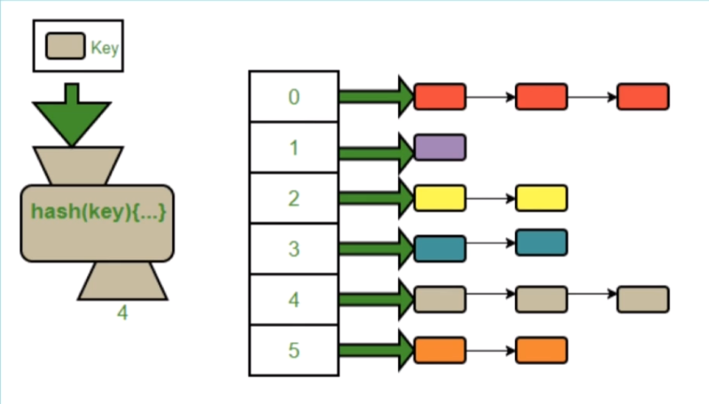

# Dictionaries

## What is Dictionaries?
- A dictionary is a collection which is unordered, changeable and indexed.

## How to create a Dictionary?
```python
myDict = dict()
print(myDict)
```
```python
engtoSp = {"one": "uno", "two": "dos", "three": "tres"}
print(engtoSp)
```
## Dictionary in Memory
A **hash table** is a way of doing **key-value lookups**. You store the values in an array, and then use a **hash function** to find the index of the array ceel that correspond to your key-value pair.

<p align="center">
    
</p>

## Inert/ Update an element in a Dictionary
```python
myDict = {'name': 'Edy', 'age': 26}
myDict['address'] = 'London'
print(myDict)
```
```
output:
{'name': 'Edy', 'age': 26, 'address': 'London'}
```
## Traversing through a dictionary
```python 
myDict = {'name': 'Edy', 'age': 26, 'address': 'London'}

def traverseDict(dict):
    for key in dict:
        print(key, dict[key])
traverseDict(myDict)
```
```
output:
name Edy
age 26
address London
```
## Search for an element in a Dictionary
```python
myDict = {'name': 'Edy', 'age': 26, 'address': 'London'}

def searchDict(dict, value):
    for key in dict:
        if dict[key] == value:
            return key, value
    return 'the value does not exist'

print(searchDict(myDict, 27))
```
## Delete/ Remove an element from a Dictionary
1. **_Using pop()_**
```python
myDict = {'name': 'Edy', 'age': 26, 'address': 'London', 'Education': 'master'}
myDict.pop('name')
print(myDict)
```
```
output: 
{'age': 26, 'address': 'London', 'Education': 'master'}
```
2. **_Using popitem()_**
```python
myDict = {'name': 'Edy', 'age': 26, 'address': 'London', 'Education': 'master'}
print(myDict.popitem())
```
```
output: 
{'name': 'Edy', 'age': 26, 'address': 'London'}
```
## Dictionary Methods
|No.| Method | Syntax |
|:------:|:-------:|:-------------:|
|1 | Clear( )     |     Dictionary.clear()|
|2 | Copy( )      |    dictionary.copy()|
|3 | Fromkeys( )  |    dictionary.fromkey(sequence[ ], value)|
|4 | get( )       |    dictionary.get(key, value)|
|5 | items( )     |    dictionary.items()|
|6 | keys( )      |    dictionary.keys()|
|7 | setdefault( )|  dictionary.setdefault(key, default_value)|
|8 | value( )     | dictionary.values()|
|9 | update( )    |dictionary.update(other_dictionary) ||
- [Click here to see the operation of all the method](https://github.com/htbitb/The-Complete-Data-Structures-and-Algorithms-Course-in-Python/tree/Dictionary/Dictionary_Method.py)

## Dictioanry vs List

|Dictionary| List|
|:----:|:------:|
|Unordered | Ordered|
|Access via Keys| Access via index
|Collection of key value pairs | Collection of elements
|Preferred when you have unique key values| Preferred when you have ordered data|
|No duplicate members| Allow duplicate members|

## Time and Space complexity of a Dictionary
|Operation|Time complexity|Space complexity|
|:------|:----:|:----:|
|Creating a Dictionary| O(len(dict)) | O(n)|
|Inserting a value in a Dictionary| O(1)/O(n)|O(1)|
|Traversing a given Dictionary| O(n) | O(1)|
|Accessing a given cell | O(1) | O(1)|
|Searching a given value| O(n) | O(1)|
|Deleting a given value | O(1) | O(1)|