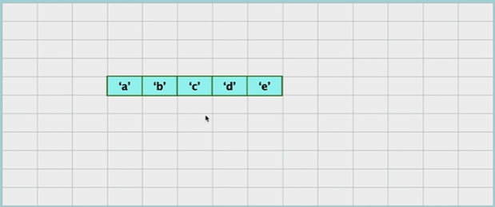

# Tuples
- [Tuples](#tuples)
  - [What is a Tuple?](#what-is-a-tuple)
  - [Tuples in Memory](#tuples-in-memory)
  - [How to traverse through Tuple](#how-to-traverse-through-tuple)
  - [Search for an element in Tuple](#search-for-an-element-in-tuple)
  - [Tuple vs Lists](#tuple-vs-lists)
  - [Time and Space Complexity in Python](#time-and-space-complexity-in-python)

## What is a Tuple?
- Tuble is an immutable sequence of python object
- Tuple are also comparable and hastable

```python
newTuple = 'a', 'b', 'c', 'd', 'e'
print(newTuple)
```
```
output: ('a', 'b', 'c', 'd', 'e')
```
- when create a new Tuple you should remember the 'comma'
  
## Tuples in Memory
**Sample Tuple**


**Memory**


## How to traverse through Tuple

```python
newTuple = ('a', 'b', 'c', 'd', 'e')

for i in range(len(newTuple)):
    print(newTuple[i])
```
```
output:
a
b
c
d
e
```

## Search for an element in Tuple
```python
newTuple = ('a', 'b', 'c', 'd', 'e')

print(newTuple.index('c'))
```

## Tuple vs Lists
Tuple like a constanst can not be modified. List is flexible and can be modified
- We generally use tuplesfor heterogeneous (different) data types and list for homogeneous (similar) data types
- Iterating through a tuple is faster than with list
- Tuples that contain immutable elements can be used as a key for a dictionary.
- If you have data that doesn't change, implementing it as tuple will guarantee that it remain write-protected.
## Time and Space Complexity in Python 
|Operation| Time Complexity| Space complexity|
|----|:------:|:-------:|
|Creating a Tuple| O(1) | O(n)|
|Traversing a given Tuple| O(n) | O(1)|
|Accessing a given element| O(1)| O(1)|
|Searching a given element| O(n) | O(1)|