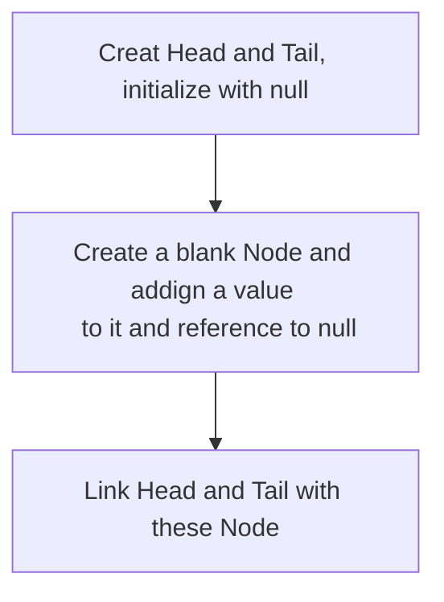

# Linked List


## What is Linked list
Linked list is a form of a sequential collection and it does not have to be in order. A linked list is made up of independent nodes that may contain any type of data and each node has a reference to the next node in the link

<p align="center">
    
</p>

## Linked list vs Arrays
- Elements o Linked list are independent objects
- Variable size - the size of a linked list is not predefined
- Insertion and removals in linked are very efficient
- Random access - accessing an element is very efficient in arrays

## Types of Linked List
There are 4 type of Linked list:
1. Singly Linked List
    <p align="left">
        
    </p>

2. Circular Singly Linked List
   
   <p align="left">
    
    </p>
3. Doubly Linked List

    <p align="left">
    
    </p>

4. Circular Doubly Linked List 
   
   <p align="left">
    
    </p>
## Create of Singly Linked List

\
&nbsp;
```python
class Node:
    def __init__(self, value = None):
        self.value = value
        self.next = None

class SlinkedList:
    def __init__(self):
        self.head = None
        self.tail = None

singlyLinkedList = SlinkedList()
node1 = Node(1)
node2 = Node(2)

singlyLikedList.head = node1
singlyLinkedList.head.next = node2
singlyLinkedList.tail = node2
```
## Insert in a Singly Linked List
There are three case of inserting in a linked list
1. At the beginning of the linked list.
2. After a node in the middle of linked list
3. At the end of the linked list
\
&nbsp;
<p align="center">
    
</p>

## Traversal of Singly Linked List
<p align="center">
    
</p>

## Search for a value in Single Linked List
<p align="center">
    
</p>

## Deletion of node from Singly Linked List
- Deleting the first node
- Deleting any given node
- Deleting the last node
\
&nbsp;
<p align="center">
    
</p>

- [Click here to see the operation of all the method](https://github.com/htbitb/The-Complete-Data-Structures-and-Algorithms-Course-in-Python/tree/Linked_List/SinglyLinkedList.py)
## Time and Space Complexity of Singly Linked List
<p align = 'center'>

||Time complexity|Space somlexity|
|:----|:---:|:---:|
|Creation| O(1) | O(1)|
|Insertion| O(n) | O(1) |
|Searching | O(n) | O(1)|
|Traversing | O(n) | O(1)|
|Deletion of a node| O(n) | O(1)|
|Detion of a linked list| O(1) | O(1)|

</p>