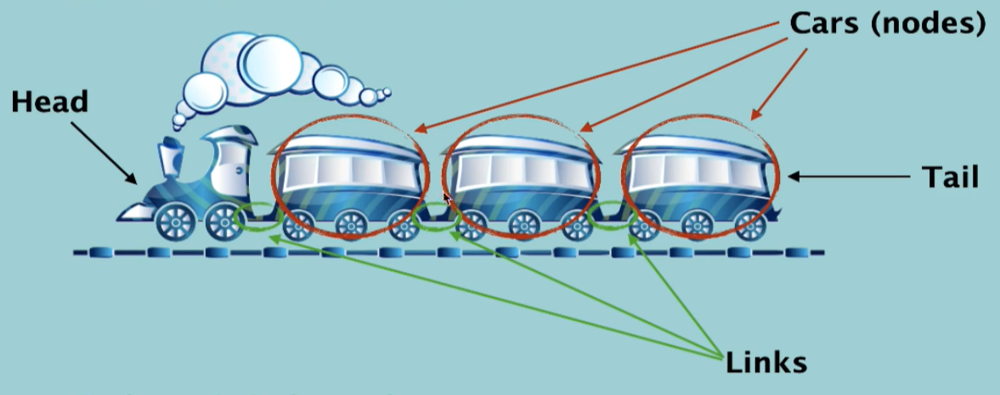
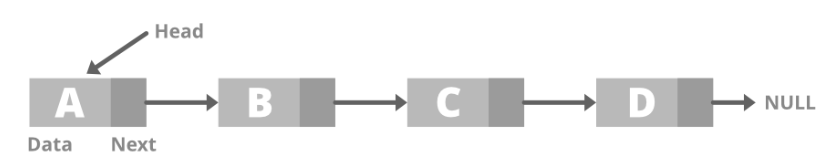
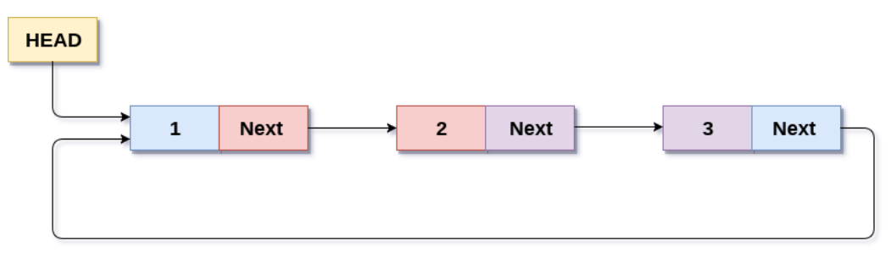
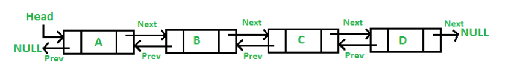
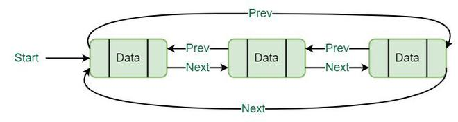

# Linked List

## What is Linked list
Linked list is a form of a sequential collection and it does not have to be in order. A linked list is made up of independent nodes that may contain any type of data and each node has a reference to the next node in the link

    

## Linked list vs Arrays
- Elements o Linked list are independent objects
- Variable size - the size of a linked list is not predefined
- Insertion and removals in linked are very efficient
- Random access - accessing an element is very efficient in arrays

## Types of Linked List
There are 4 type of Linked list:
1. Singly Linked List
    

        
    

2. Circular Singly Linked List
   
   

    
    

3. Doubly Linked List

    

    
    

4. Circular Doubly Linked List 
   
   

    
    

## Linked List in the memory
